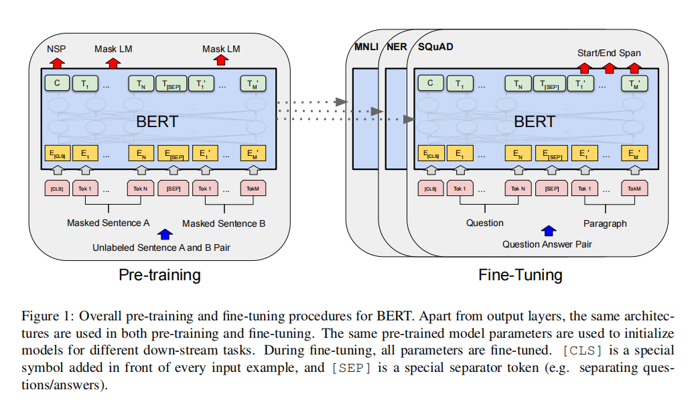
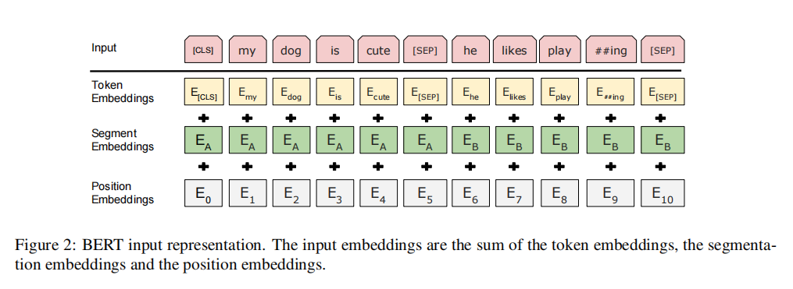
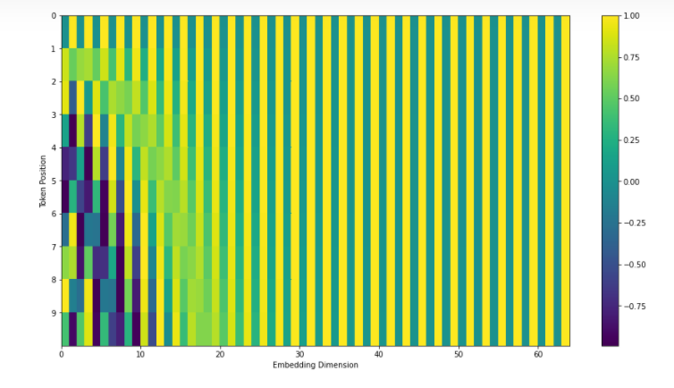

数据集
https://ai-studio-online.bj.bcebos.com/v1/67a38f24198e4fd8baeadc7c5353bcbad8102d1f17084874b49dcc7aaee90271?responseContentDisposition=attachment%3Bfilename%3Dlcsts_data.zip&authorization=bce-auth-v1%2F5cfe9a5e1454405eb2a975c43eace6ec%2F2025-05-09T12%3A03%3A39Z%2F60%2F%2F483c55f029fd969d73d56975f302a44f8a29b6a504faa93ac297499769fd733f
下载后解压到data文件夹下

模型

BERT（Bidirectional Encoder Representations from Transformers）意为来自Transformer的双向编码器表征。不同于最近的语言表征模型，BERT旨在基于所有层的左、右语境来预训练深度双向表征。因此，预训练的BERT表征可以仅用一个额外的输出层进行微调，进而为很多任务(如问答和语言推理)创建当前最优模型，无需对任务特定架构做出大量修改。

BERT模型架构是一种多层双向Transformer编码器。

本文设置前馈/过滤器的尺寸为4H，如H=768时为3072，H=1024时为4096。

主要展示在两种模型尺寸上的结果：

BERTBASE：L=12，H=768，A=12，总参数=110M

BERTLARGE：L=24，H=1024，A=16，总参数=340M

语言模型预训练已被证明可有效改进许多自然语言处理任务。

将预训练语言表征应用于下游任务有两种现有策略：基于特征feature-based和微调fine-tuning。

基于fine-tuning的方法主要局限是标准语言模型是单向的，极大限制了可以在预训练期间使用的架构类型。

BERT通过提出一个新的预训练目标：遮蔽语言模型”(maskedlanguage model，MLM)，来解决目前的单向限制。

该MLM目标允许表征融合左右两侧语境语境。除了该遮蔽语言模型，BERT还引入了一个“下一句预测”(nextsentence prediction)任务用于联合预训练文本对表征。

论文贡献如下：

证明了双向预训练对语言表征量的重要性。
展示了预训练表征量能消除许多重型工程任务特定架构的需求。
（BERT是第一个基于微调的表征模型，它在大量的句子级和词块级任务上实现了最先进的性能）

BERT推进了11项NLP任务的最高水平。
模型框架

BERT模型架构是一种多层双向Transformer编码器。

本文设置前馈/过滤器的尺寸为4H，如H=768时为3072，H=1024时为4096。

主要展示在两种模型尺寸上的结果：

BERTBASE：L=12，H=768，A=12，总参数=110M

BERTLARGE：L=24，H=1024，A=16，总参数=340M

注意：BERT变换器使用双向自注意力机制
输入表征

对于每一个token, 它的表征由对应的token embedding, 段表征(segment embedding)和位置表征(position embedding)，其中位置表征支持的序列长度最多为512个词块。 （如果使用bert预训练模型的话不能改，要是自己训练的话可以自己定义，不一定要按照512，这里原文是为了平衡效率和性能）

其中，位置表征(position embedding)是由Transformer提出，目的是为了对不同位置的信息进行编码。

这里有两种实现方法：拼接和求和，详情见Transformer 中的 positional embedding

预训练任务

作者使用两个新型无监督预测任务对BERT进行预训练

遮蔽语言模型
随机遮蔽输入词块的某些部分，然后仅预测那些被遮蔽词块。Bert将这个过程称为“遮蔽LM”(MLM)。

具体实现方式为： 训练数据生成器随机选择15％的词块。然后完成以下过程：

并非始终用[MASK]替换所选单词，数据生成器将执行以下操作：

80％的训练数据：用[MASK]词块替换单词，例如，【我的狗是毛茸茸的！】【我的狗是[MASK]】
10％的训练数据：用随机词替换遮蔽词，例如，【我的狗是毛茸茸的！】【我的狗是苹果】
10％的训练数据：保持单词不变，例如，【我的狗毛茸茸的！】【我的狗毛茸茸的！】这样做的目的是将该表征偏向于实际观察到的单词。
下一句预测模型
为了训练一个理解句子关系的模型，我们预训练了一个二值化下一句预测任务，该任务可以从任何单语语料库中轻松生成。

具体实现方式为：选择句子A和B作为预训练样本：B有50%的可能是A的下一句，也有50%的可能是来自语料库的随机句子

输入=[CLS]男子去[MASK]商店[SEP]他买了一加仑[MASK]牛奶[SEP]

Label= IsNext

输入=[CLS]男人[面具]到商店[SEP]企鹅[面具]是飞行##少鸟[SEP]

Label= NotNext
总结

BERT使用了更加高效的Transformer结构，高效获取了训练数据的双向表征信息。

文章做了非常详细的消融实验，建议感兴趣的同学可以详细的品读一下原文。
数据处理

位置编码

模型训练

模型测试